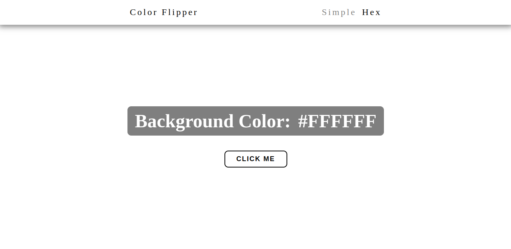
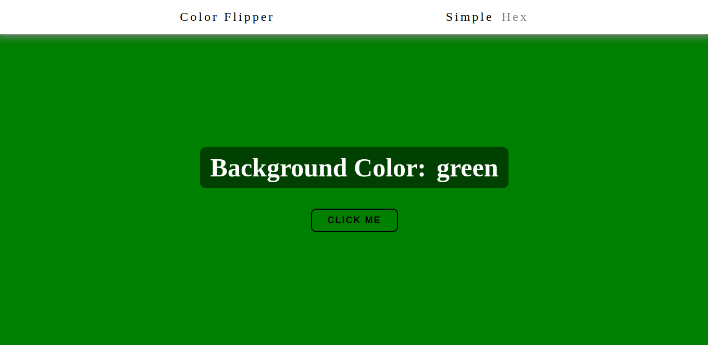

# Collor Flipper

With this application you can generate random colors. It can be one out of 16 simple colors or any hex color.

## Table of contents

- [The challenge](#the-challenge)
- [Screenshots](#screenshots)
- [Tech Stack](#tech-stack)
- [Links](#links)

## The challenge

Users should be able to:

- Generate random color by clicking "click me" button
- Change application mode from top menu
- View the optimal layout for the interface depending on their device's screen size
- See hover and focus states for all interactive elements on the page

## Screenshots

## Tech Stack

- HTML
- CSS
- JavaScript

## Links

- [Live Site URL](https://small-projects-wwk7.vercel.app/)
