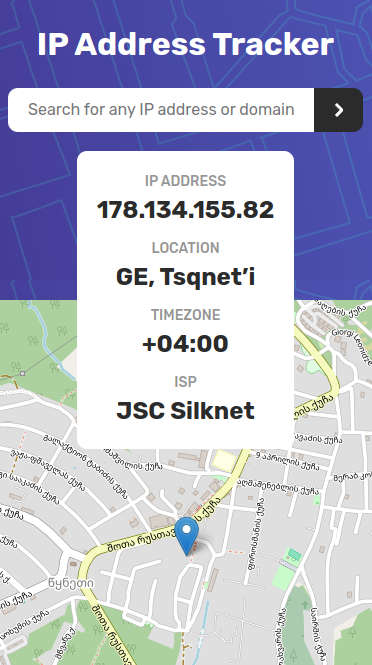

# IP Address Tracker

This is a solution to the [IP address tracker challenge on Frontend Mentor](https://www.frontendmentor.io/challenges/ip-address-tracker-I8-0yYAH0).

## Table of contents

- [The challenge](#the-challenge)
- [Design](#design)
- [Tech Stack](#tech-stack)
- [Links](#links)

## The challenge

Users should be able to:

- View the optimal layout for each page depending on their device's screen size
- See hover states for all interactive elements on the page
- See their own IP address on the map on the initial page load
- Search for any IP addresses or domains and see the key information and location

## Design

## Tech Stack

- React
- TypeScript
- Module CSS
- Axios
- React Leaflet

## Links

- [Challange URL](https://www.frontendmentor.io/challenges/ip-address-tracker-I8-0yYAH0)
- [Ipify API docs](https://geo.ipify.org/docs)
- [Live Site URL](https://07-ip-address-tracker.vercel.app/)
